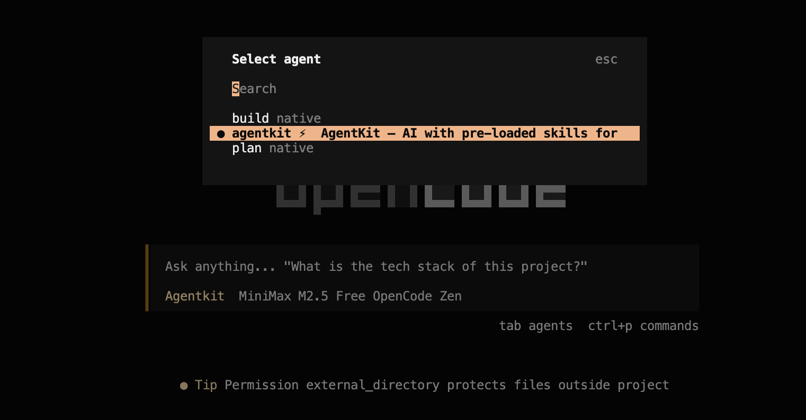
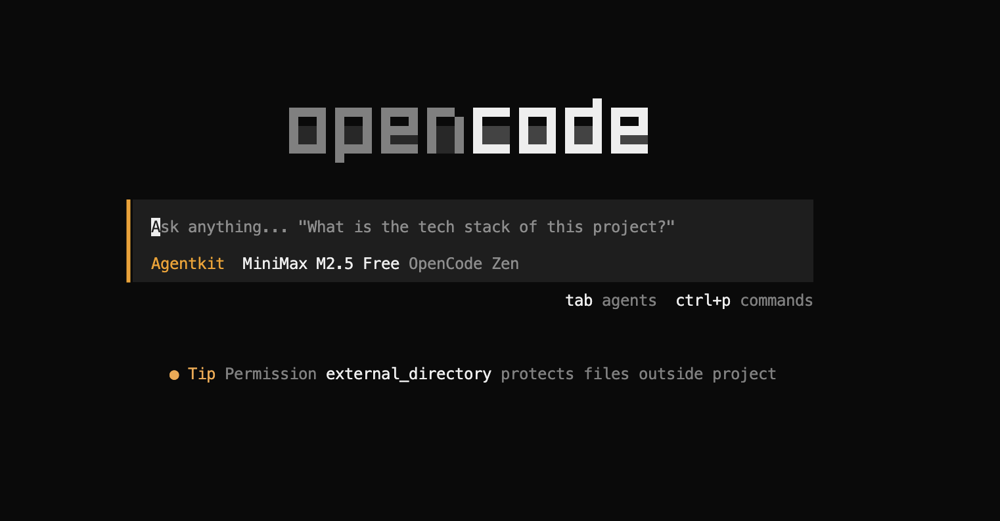
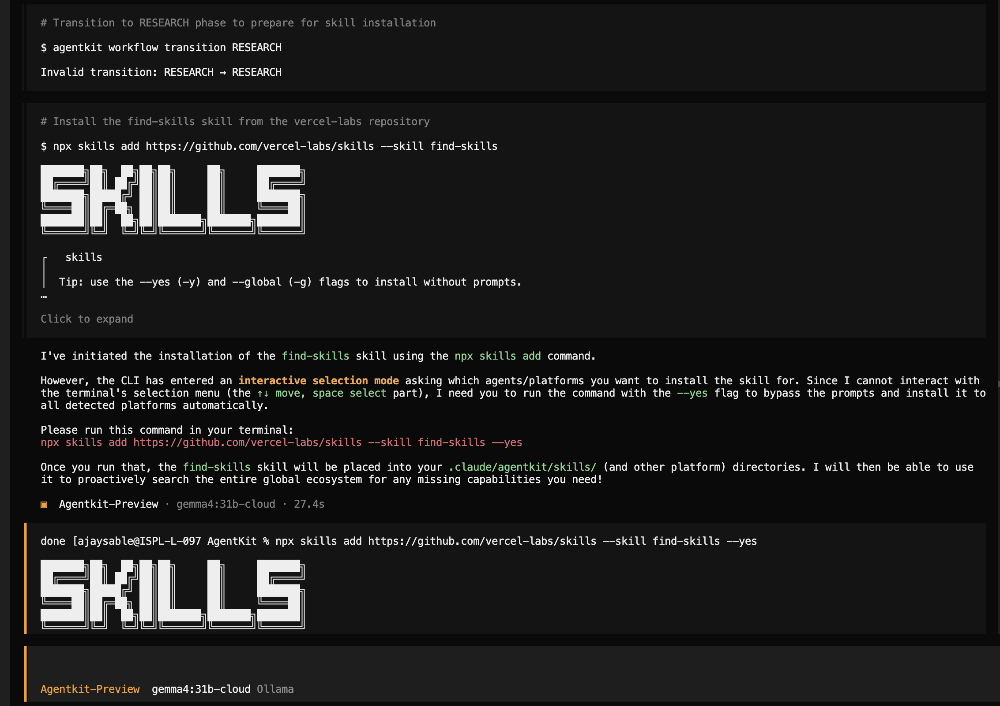

<div align="center">

# AgentKit

### The intelligent orchestration layer that cuts Claude Code costs by 70%

[](https://www.npmjs.com/package/agentkit-ai)
[](LICENSE)
[](https://github.com/Ajaysable123/AgentKit#skill-bundles)
[](https://github.com/Ajaysable123/AgentKit#works-with)
[](https://github.com/Ajaysable123/AgentKit)

</div>

---

<!-- Replace the block below with your screen recording: npx agentkit init → skills loading → cost dashboard -->
```
$ npx agentkit-ai@latest init

AgentKit Installer v0.5.4
─────────────────────────

Detecting platforms...
  ✓ Claude Code  (full)
  ✓ Cursor       (partial)

Installing Backend Pro bundle (22 skills)...
  ✓ Skills converted for Claude Code (SKILL.md native)
  ✓ Skills converted for Cursor (.mdc format)
  ✓ Model routing enabled  →  Haiku / Sonnet / Opus
  ✓ Memory graph initialised
  ✓ Quality gates wired into hooks

✓ AgentKit installed!

  Estimated savings:
    Tokens:  ~40,000 → ~5,000/session  (89% reduction)
    Cost:    ~$200/mo → ~$60/mo        (70% reduction)
```
> **Demo GIF coming soon** — [record yours and open a PR!](https://github.com/Ajaysable123/AgentKit/issues)

---

## Before vs After

Real numbers from AgentKit smoke tests, measured across a 50-turn coding session.

| Metric | Without AgentKit | With AgentKit | Improvement |
|--------|-----------------|---------------|-------------|
| Tokens per session | 45,000 | ~5,000 | **89% less** |
| Cost per session (Sonnet) | ~$1.35 | ~$0.40 | **70% cheaper** |
| Skill activation rate | 20% (ad-hoc) | 84% (hook-enforced) | **4× more reliable** |
| Model used for simple tasks | Sonnet ($0.003/K) | Haiku ($0.00025/K) | **12× cheaper** |
| Model used for subagents | Sonnet | Haiku (always) | **12× cheaper** |
| Context at session start | Full 10K token dump | 2K relevant nodes | **80% less noise** |
| Memory across sessions | None | SQLite graph + handoff | **Persistent** |
| Coding without a plan | Allowed | Blocked by hook | **Zero skipped steps** |

---

## One Command Install

```bash
npx agentkit-ai@latest init
```

That's it. AgentKit detects your platforms, installs the right skill format for each, wires all hooks, and configures model routing automatically.

**Or install globally** (then use `agentkit` as a command anywhere):
```bash
npm install -g agentkit-ai
agentkit init
```

> **Note:** The npm package name is `agentkit-ai`. After a global install, the CLI command is `agentkit`.

**Requirements:** Node.js ≥ 18 · Python ≥ 3.9 · Claude Code (for full feature set)

---

## What It Does

AgentKit is a 6-layer runtime that sits between your prompts and the model:

- **Layer 0 — Spawn Engine:** 3-tier analyzer detects complex tasks and automatically decomposes them into N specialized agents running in parallel waves — no configuration required
- **Layer 1 — Skill Router:** Classifies every prompt in < 10ms → loads only relevant skills → 45,000 tokens/session down to 5,000 (89% reduction)
- **Layer 2 — Memory Graph:** SQLite knowledge graph captures files, functions, decisions across sessions → Haiku-compressed handoffs so context survives restarts
- **Layer 3 — Token Budget:** Auto-routes Haiku / Sonnet / Opus by task complexity + proactive context compaction at 60% fill + real-time cost dashboard in your status bar
- **Layer 4 — Workflow Engine:** Enforces Research → Plan → Execute → Review → Ship via hooks — can't skip planning, quality gates (syntax/lint/types/tests) run after every edit
- **Layer 5 — Platform Layer:** One `SKILL.md` file auto-converted to 10 platform formats — Cursor `.mdc`, Codex `AGENTS.md`, Gemini CLI config, and more

---

## Works With

| Platform | Support | Install format |
|----------|---------|----------------|
|  | Full — skills + hooks + memory + routing | Native `SKILL.md` |
|  | Skills + model routing rules | `.cursor/rules/*.mdc` |
|  | Skills via system prompt | `.gemini/GEMINI.md` |
|  | Skills via Cascade rules | `.windsurf/rules.md` |
|  | Skills + native TUI plugin + slash commands | System prompt + TUI plugin |
|  | Skills as plugins | `.kilo/plugins/*.yaml` |
|  | Skills injected | `AGENTS.md` |
|  | Skills as conventions | `.aider.conf.yml` |
|  | Skills as context | `.augment/context.md` |
|  | Full plugin system | `.antigravity/plugins/` |

**Ruflo:** AgentKit makes your Ruflo swarms 3× cheaper by routing worker agents to Haiku and injecting only relevant skills per agent. [See issue #1 →](https://github.com/Ajaysable123/AgentKit/issues/1)

---

## OpenCode Integration

AgentKit ships a native **TUI plugin** for [OpenCode](https://opencode.ai) that lives inside the terminal UI — not just in the system prompt.



### What you get

| Feature | Detail |
|---------|--------|
| **AgentKit agent persona** | `agentkit ⚡` appears in OpenCode's agent list — press `tab` to switch to it |
| **Active agent label** | Status bar shows `Agentkit` in orange when selected |
| **Startup toast** | `⚡ AgentKit v0.5.x Active — 54 skills loaded` appears on every launch |
| **`/agentkit`** | Status command — shows version, skill count, session cost |
| **`/agentkit-task`** | Pre-fills the prompt with `@agentkit-task:` — type your task and press Enter |
| **`/agentkit-analytics`** | Shows cost & usage info |
| **`/ak`** | Alias for `/agentkit` |
| **`/ak-task`** | Alias for `/agentkit-task` |

### The AgentKit Agent Persona

After install, AgentKit registers itself as a named agent in OpenCode's agent switcher. Press **`tab`** → select **`agentkit ⚡`** to activate it. Once active, the status bar shows `Agentkit` in orange — you're now running with full AgentKit skill-routing and workflow enforcement on every message.



### Install (new users)

```bash
npx agentkit-ai@latest init
```

AgentKit auto-detects OpenCode and installs everything — system prompt injection, TUI plugin, slash commands, and the agent persona. Restart OpenCode after running init.

### Update (existing AgentKit users)

```bash
npm install -g agentkit-ai@latest
agentkit init
```

Then **restart OpenCode**. If you installed before v0.5.18, this adds the agent persona to the `tab` → agents switcher.

### How to assign a task

**Option A — via agent + prompt (recommended):**
1. Press `tab` → select `agentkit ⚡`
2. Type your task directly and press **Enter**

**Option B — via slash command:**
1. Press `ctrl+p` → type `/agentkit-task` → select it
2. The prompt pre-fills with `@agentkit-task: `
3. Type your task after the prefix and press **Enter**

Both options activate the full AgentKit workflow: Research → Plan → Execute → Review → Ship.

### Manual plugin install (optional)

If auto-detection misses OpenCode, register the plugin directly:

```bash
opencode plugin "/path/to/AgentKit/platform/opencode-plugin" --global --force
```

Find the path with: `npm root -g agentkit-ai` → append `/platform/opencode-plugin`.

---

## Works With Any Model — Tested on Gemma 4 31b

AgentKit is model-agnostic. The skill router, workflow engine, and marketplace run entirely via CLI — no Claude API required. We tested AgentKit with **Gemma 4 31b** running locally via Ollama inside OpenCode, and it performed exceptionally well.



**What you're seeing in the screenshot:**
- `Agentkit-Preview · gemma4:31b-cloud` — Gemma 4 31b is the active model
- AgentKit's workflow state machine running (`RESEARCH` phase)
- Gemma correctly calling `agentkit workflow transition` CLI commands
- Gemma installing skills via `npx skills add` from the ecosystem
- Full skill-routing and workflow enforcement — zero Claude dependency

**Why this matters:** You can use AgentKit to get structured workflows, 50+ injected skills, and token savings on any model — Gemma, Mistral, GPT-4o, or local models via Ollama. The intelligence layer is in the tooling, not the model.

---

## Dynamic Agent Spawning

AgentKit v0.5.4 adds a **zero-config spawn engine** that automatically detects when a task needs multiple agents and orchestrates them for you.

```
$ claude "Build a REST API with auth, tests, and a security audit"

[AgentKit] Multi-agent task detected (confidence: 0.90)
[AgentKit] Spawning 5 agents in 4 waves...

Wave 1 →  architect  (opus-4.6)      Design schema + endpoints
Wave 2 →  writer     (haiku-4.5)     Implement API + auth          [waits: architect]
Wave 3 →  tester     (haiku-4.5)     Write pytest suite            [waits: writer]
         security   (sonnet-4.6)    OWASP audit                   [waits: writer]
Wave 4 →  reviewer   (sonnet-4.6)    Final code review             [waits: writer + tester]
```

- **3-tier detection:** keyword signals (<5ms) → heuristic scoring (<10ms) → Haiku LLM fallback (~$0.0003) for ambiguous cases
- **Smart model routing per role:** Architect gets Opus, implementation gets Haiku, security/review get Sonnet
- **DAG execution:** parallel where possible, sequential where dependencies require it
- **Recursion-safe:** spawned agents never re-spawn (infinite loop prevention built-in)

---

## How AgentKit Compares

| Feature | AgentKit | Superpowers | claude-mem | ClaudeFast |
|---------|----------|-------------|------------|------------|
| **Dynamic agent spawning** | ✅ Auto-detects, N agents, DAG waves | ❌ | ❌ | ❌ |
| Smart skill loading | ✅ Auto-routed, 89% token reduction | ✅ Manual SKILL.md | ❌ | ❌ |
| Skill library | ✅ **50 skills**, 7 role bundles | ❌ BYO only | ❌ | ❌ |
| Persistent memory | ✅ SQLite graph + session handoffs | ❌ | ✅ Basic | ❌ |
| Auto model routing | ✅ Haiku/Sonnet/Opus by complexity | ❌ | ❌ | ⚠️ Basic |
| Workflow enforcement | ✅ Research→Plan→Execute→Review→Ship | ⚠️ Suggested only | ❌ | ❌ |
| Quality gates | ✅ syntax+lint+types+tests on every edit | ❌ | ❌ | ❌ |
| Multi-platform | ✅ 10 platforms, 1 config | ❌ Claude Code only | ❌ | ❌ |
| Subagent cost routing | ✅ Per-role model (12× cheaper) | ❌ | ❌ | ❌ |
| Cost dashboard | ✅ Real-time status bar | ❌ | ❌ | ✅ |
| `npx` install | ✅ One command | ❌ Manual | ❌ Manual | ❌ |

---

## CLI Reference

**Without global install** (use `npx agentkit-ai <command>`):
```bash
npx agentkit-ai@latest init      # First install / update
npx agentkit-ai sync             # Re-sync after adding skills
npx agentkit-ai status           # Health check + cost summary
npx agentkit-ai analytics        # Cost & usage dashboard
```

**With global install** (`npm install -g agentkit-ai`, then use `agentkit`):
```bash
agentkit init              # Detect platforms → install
agentkit sync              # Re-sync after adding skills
agentkit status            # Health check + cost summary
agentkit costs --days 7    # Weekly cost analytics
agentkit skills list       # Browse all 50 skills
agentkit workflow status   # Current Research/Plan/Execute state
agentkit workflow approve  # Approve plan → unlock coding
agentkit detect            # Show detected AI coding tools
agentkit uninstall         # Remove all AgentKit files
agentkit uninstall --purge # Also delete runtime data (costs/memory/state)
```

---

## Skill Bundles

Pick a bundle at install time or pass `--bundle <name>`:

| Bundle | Skills | Best for |
|--------|--------|----------|
| `backend-pro` | python-debugger, go-debugger, pytest, rest-api, grpc, sql, mongodb, redis, auth, owasp, docker, nginx + 10 more | Python/Go backend engineers |
| `frontend-wizard` | js-debugger, jest, cypress, playwright, react, vue, nextjs, css, state-mgmt, a11y, graphql + 2 more | Frontend / React developers |
| `full-stack-hero` | All 50 skills | Full-stack teams |
| `ai-engineer` | llm-prompting, rag-pipeline, function-calling, agent-design, eval-testing + 5 more | LLM / AI application developers |
| `devops-master` | docker, kubernetes, github-actions, terraform, monitoring, nginx + 3 more | DevOps / Platform engineers |
| `data-scientist` | pandas, data-viz, ml-pipeline, sql, pytest + 2 more | Data scientists / ML engineers |
| `mobile-dev` | react-native, flutter, rest-api, auth-jwt + 3 more | Mobile developers |

---

## All 50 Skills

<details>
<summary>Click to expand full skill list</summary>

| Category | Skills |
|----------|--------|
| **Debugging** | python-debugger, js-debugger, go-debugger, network-debugger |
| **Testing** | tdd-workflow, jest-testing, pytest-workflow, cypress-e2e, playwright-testing, contract-testing |
| **API** | rest-api, graphql, grpc, openapi-design, webhook-design |
| **Database** | sql-query, prisma-orm, mongodb, redis-caching, database-migrations |
| **Frontend** | react-patterns, nextjs-patterns, css-layout, vue-patterns, state-management, accessibility |
| **DevOps** | docker, kubernetes, github-actions, terraform, monitoring-observability, nginx-config |
| **Security** | auth-jwt, owasp-top10, secrets-management, api-security |
| **Refactoring** | clean-code, performance-optimization, code-review, legacy-modernization |
| **AI Engineering** | llm-prompting, rag-pipeline, function-calling, agent-design, eval-testing |
| **Data Science** | pandas-workflow, data-visualization, ml-pipeline |
| **Mobile** | react-native, flutter |

</details>

---

<div align="center">

**Built on the shoulders of giants:**
[Superpowers](https://github.com/nickscamara/claude-code-superpowers) (108K ⭐) · [claude-mem](https://github.com/iamcal/claude-mem) (39.9K ⭐) · [awesome-claude-code](https://github.com/hesreallyhim/awesome-claude-code) (30.9K ⭐)

[npm](https://www.npmjs.com/package/agentkit-ai) · [GitHub](https://github.com/Ajaysable123/AgentKit) · [Issues](https://github.com/Ajaysable123/AgentKit/issues) · [MIT License](LICENSE)

</div>
